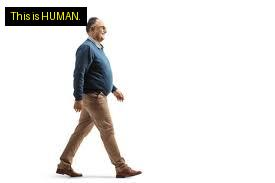

🧠 Qwen2-VL-2B Finetuning: Human or Animal Image Classification

This project demonstrates the finetuning and evaluation of the Qwen2-VL-2B model on a custom image dataset to identify whether the subject in an image is a human or a specific animal (gorilla, dog, cat). The model was finetuned using LLaMA-Factory, exported to Hugging Face, and evaluated with 100% accuracy on a structured test set.

📍 Hugging Face Model:
👉 https://huggingface.co/Kaushika04/qwen2vl_2b_instruct_lora_merged_HUMAN_OR_ANIMAL_IMAGE_FINETUNING_kaushika

📦 Project Structure:
.
├── Human_Animal_Classification.ipynb   # Main evaluation notebook
├── test_dataset/                       # Test images (1.jpg to 12.jpg)
└── kaushika/                           # Finetuned dataset images

🧪 Model Details:
- Base Model: Qwen2-VL-2B (https://huggingface.co/Qwen/Qwen2-VL-2B)
- Framework: LLaMA-Factory
- Epochs Trained: 100
- Exported To: https://huggingface.co/Kaushika04
- Evaluation Interface: Hugging Face Transformers + Custom VQA Dataset

🗂️ Dataset Preprocessing:
The dataset used for fine-tuning contains a total of 80 images, divided equally among four classes:
- 20 images of gorillas
- 20 images of dogs
- 20 images of cats
- 20 images of humans

Each image was annotated using the VQA (Visual Question Answering) format. Example:
{
  "messages": [
    {
      "content": "<image> Who is this?",
      "role": "user"
    },
    {
      "content": "This is HUMAN.",
      "role": "assistant"
    }
  ],
  "images": [
    "kaushika/human_20.jpg"
  ]
}

🧪 Evaluation Results:
✅ Accuracy: 100.00% on 12 test images

| Image  | Prediction                      |
|--------|----------------------------------|
| 1.jpg  | This is an animal - gorilla.    |
| 2.jpg  | This is an animal - gorilla.    |
| 3.jpg  | This is an animal - dog.        |
| 4.jpg  | This is an animal - dog.        |
| 5.jpg  | This is an animal - cat.        |
| 6.jpg  | This is an animal - cat.        |
| 7.jpg  | This is an animal - dog.        |
| 8.jpg  | This is an animal - gorilla.    |
| 9.jpg  | This is HUMAN.                  |
| 10.jpg | This is HUMAN.                  |
| 11.jpg | This is HUMAN.                  |
| 12.jpg | This is HUMAN.                  |

 
    

      
       <i>OUTPUT IMAGE.</i>
    

    
🖼️ Visualization:
After generating text responses for each image, the text was written directly onto the image using the PIL (Python Imaging Library), making the predictions visually interpretable.

⚠️ Challenges Faced:
- Training on Google Colab resulted in Out of Memory (OOM) issues, especially when generating and saving large batches of images with overlaid text.
- The batch sizes were reduced, and intermediate image outputs were cached to mitigate GPU limits.

🚀 Requirements:
Install necessary dependencies:
pip install torch torchvision transformers pillow

✨ Credits:
- Qwen2-VL-2B by Alibaba Cloud
- LLaMA-Factory for model finetuning
- Kaushika04 on Hugging Face for hosting the finetuned model

